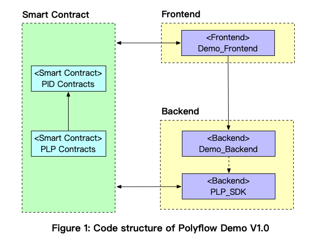

 

# PolyFlow 🚀

---

🌐 **Language**: [English](./README.md)   | [中文](./README_zh.md)  

---

## 🚀 Overview
PolyFlow is the first PayFi infrastructure designed to seamlessly connect **RWA** (Real-World Assets) with **DeFi**. It achieves this by introducing two core products:

- **PID** (Payment ID): The gateway for compliance access.  
- **PLP** (PolyFlow Liquidity Pool): The entry point for fund custody.  

PolyFlow pioneers a new financial paradigm, evolving from "Buy Now, Pay Later" to **"Buy Now, Pay Never"**. 🌟

🌐 **Demo URL**: [Try Demo](https://hashkey-xi.vercel.app/) &nbsp;&nbsp;| &nbsp;&nbsp; 🐦 **Twitter/X**：[https://x.com/Polyflow_PayFi](https://x.com/Polyflow_PayFi) 

---

## 🛠️ Tech Stack

### Frontend:
- **Next.js**、**TailwindCSS**、**Wagmi**、**RainbowKit**、**TypeScript**

### Backend:
- **Golang**、**MySQL**、**Redis**

### Smart Contract:
- **Solidity**、**JavaScript**、**Hardhat**、**Foundry**

### Deployment:
- **Vercel**、**Docker**、**Kubernetes**、**AWS**

---

## 🎥 Demo
- 📹 **Demo Video**: [https://youtu.be/Cwd-mCw5IVw](https://youtu.be/Cwd-mCw5IVw)
- 📜 **Project Deck**: [https://docs.google.com/presentation/d/1fIdHYbkDmidwaaYW3-xW0S2nGWRrqeTMgiMbMK54Fns/edit?usp=sharing](https://docs.google.com/presentation/d/1fIdHYbkDmidwaaYW3-xW0S2nGWRrqeTMgiMbMK54Fns/edit?usp=sharing)

- 🌐 **Demo URL**: [Try Demo](https://hashkey-xi.vercel.app/)

---

## 👥 Team

- **Konit** - Architect  
- **Kevin** - Product Manager
- **Shera** - Head of Ecosystem  

---

## 📂 Code

### Frontend:
- **Demo_Frontend**: [https://github.com/Polyflow-Protocol/Demo_Frontend](https://github.com/Polyflow-Protocol/Demo_Frontend)

### Backend:
- **Demo_Backend**: [https://github.com/Polyflow-Protocol/Demo_backend](https://github.com/Polyflow-Protocol/Demo_backend)
- **PLP_SDK**: [https://github.com/Polyflow-Protocol/PLP_go_sdk](https://github.com/Polyflow-Protocol/PLP_go_sdk)

### Smart Contract:
- **PID** (Payment ID): [https://github.com/Polyflow-Protocol/Demo_PID_Contracts](https://github.com/Polyflow-Protocol/Demo_PID_Contracts)
- **PLP** (PolyFlow Liquidity Pool): [https://github.com/Polyflow-Protocol/Demo_PLP_Contracts](https://github.com/Polyflow-Protocol/Demo_PLP_Contracts)
---

## 📑 Code Structure

  

---

💡 **Stay tuned for updates and innovations!** ✨
