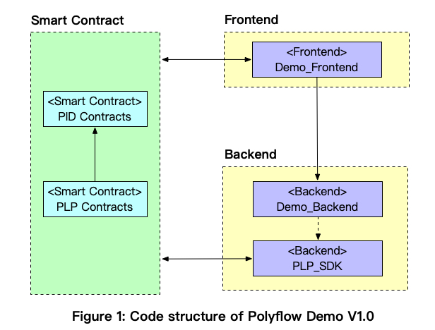

 

# PolyFlow 🚀

---

🌐 **语言**: [英文](./README.md) | [中文](./README_zh.md)  

---

## 🚀 概览
PolyFlow 是首个PayFi 基础设施，通过提供核心产品 **PID(支付 ID)** 作为合规准入的入口，和 **PLP(PolyFlow 流动性池)** 作为资金托管的入口，推动 RWA 与 DeFi 无缝连接，实现从 **“Buy Now, Pay Later”** 到 **“Buy Now, Pay Never”** 的全新金融范式🌟

- 🌠**演示链æ¥**：[https://hashkey-xi.vercel.app/](https://hashkey-xi.vercel.app/)    |    🦠**æ¨ç‰¹/X**：[https://x.com/Polyflow_PayFi](https://x.com/Polyflow_PayFi)

---

## 🛠️ 技术栈

### 前端：
- **Next.js**、**TailwindCSS**、**Wagmi**、**RainbowKit**、**TypeScript**

### 后端：
- **Golang**、**MySQL**、**Redis**

### 智能合约：
- **Solidity**、**JavaScript**、**Hardhat**、**Foundry**

### 部署：
- **Vercel**、**Docker**、**Kubernetes**、**AWS**

---

## 🎥 演示

- 📹 **演示视频**：[https://youtu.be/Cwd-mCw5IVw](https://youtu.be/Cwd-mCw5IVw)  
- 📜 **项目资料**：[https://docs.google.com/presentation/d/1fIdHYbkDmidwaaYW3-xW0S2nGWRrqeTMgiMbMK54Fns/edit?usp=sharing](https://docs.google.com/presentation/d/1fIdHYbkDmidwaaYW3-xW0S2nGWRrqeTMgiMbMK54Fns/edit?usp=sharing)  
- 🌐 **演示链接**：[Try Demo](https://hashkey-xi.vercel.app/)

---

## 👥 团队

- **Konit** - 架构师  
- **Kevin** - 产品经理
- **Shera** - 生态负责人  

---

## 📂 代码

### 前端：
- **Demo_Frontend**: [https://github.com/Polyflow-Protocol/Demo_Frontend](https://github.com/Polyflow-Protocol/Demo_Frontend)

### 后端：
- **Demo_Backend**: [https://github.com/Polyflow-Protocol/Demo_backend](https://github.com/Polyflow-Protocol/Demo_backend)
- **PLP_SDK**: [https://github.com/Polyflow-Protocol/PLP_go_sdk](https://github.com/Polyflow-Protocol/PLP_go_sdk)

### 智能合约：
- **PID** (Payment ID): [https://github.com/Polyflow-Protocol/Demo_PID_Contracts](https://github.com/Polyflow-Protocol/Demo_PID_Contracts)
- **PLP** (PolyFlow Liquidity Pool): [https://github.com/Polyflow-Protocol/Demo_PLP_Contracts](https://github.com/Polyflow-Protocol/Demo_PLP_Contracts)
---

## 📑 代码结构

  

---

💡 **敬请期待更多更新与创新！** ✨
