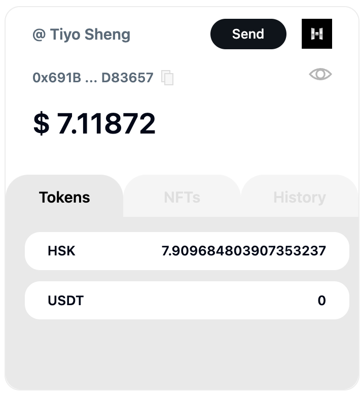
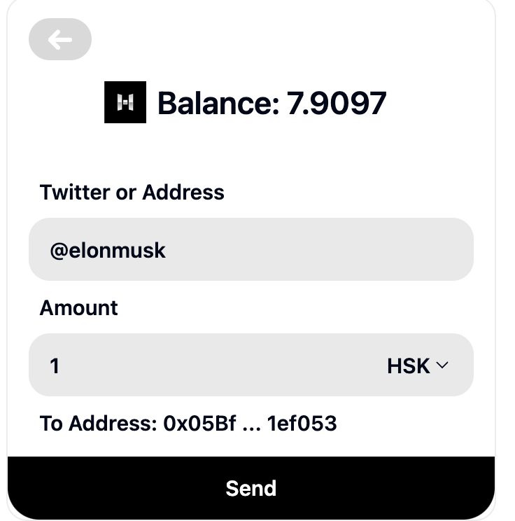

# XWallet

## Overview
X-Wallet is a next-generation Ethereum wallet designed to bring mass adoption to Web3 by offering a rich feature set built on Account Abstraction (AA) technology. It focuses on delivering a seamless, user-friendly, and innovative experience for both Web2 and Web3 users.
This time we integrate hsk chain with AA and implement aa token trasfer.

  
  

## Tech Stack
- Frontend: React, TailwindCSS, Plasmo
- Backend: Node.js, Express
- Deployment: AWS

## Demo
- Code Repo: https://github.com/accountjs/XWallet/tree/hsk
- Demo Video: https://www.youtube.com/watch?v=6F5nezkBNHs
- Project Deck: https://pitch.com/public/dbed39e1-6006-48fd-a72c-5df2d6324158/84c16832-f5de-4174-b20a-bc5a217a2ce5

## Team
- Xixi - COO
- Skyhigh - Product
- Damao - Full Stack Developer
